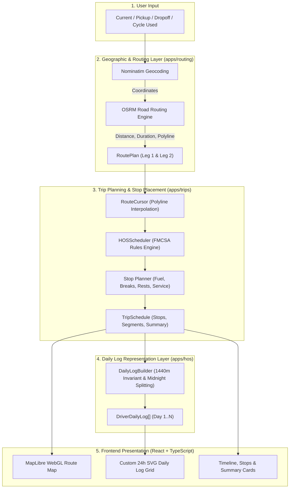

# Spotter Truck Driver HOS Planner

A production-ready full-stack trucking trip planning application and Hours of Service (HOS) scheduling engine. Given a driver's **Current Location**, **Pickup Location**, **Dropoff Location**, and **Current 70-hour / 8-day Cycle Hours Used**, the system geocodes locations, computes real road routing, calculates compliant driving/rest/fuel/pickup/dropoff schedules, visualizes the route on an interactive MapLibre map, and generates 24-hour FMCSA-style daily driver logs with minute-accurate stepped graphs.

---

## 1. Live Demo

- **Frontend Application**: [https://spotter-truck-planner.vercel.app](https://spotter-truck-planner.vercel.app) *(or local: `http://localhost:5173`)*
- **Backend Health Check**: [https://spotter-truck-planner-api.onrender.com/api/health/](https://spotter-truck-planner-api.onrender.com/api/health/) *(or local: `http://127.0.0.1:8000/api/health/`)*

---

## 2. What It Does

Commercial truck drivers in the United States must strictly adhere to federal safety regulations governing driving hours and rest periods. Planning long-haul routes requires balancing real-world road geometry with complex temporal rules.

This application provides an automated end-to-end dispatch and compliance workflow:
1. **Geocoding & Validation**: Converts location names into geographic coordinates with fallback handling.
2. **Multi-Leg Road Routing**: Queries open-source road network engines to extract realistic highway distances and driving durations across two legs (Origin → Pickup and Pickup → Dropoff).
3. **FMCSA HOS Scheduling**: Injects mandatory duty periods (1h pickup, 1h dropoff, 30m breaks, 10h sleeper rests, 1,000-mile fuel stops) without violating driving limits or duty windows.
4. **Geographic Stop Interpolation**: Uses mathematical polyline interpolation (`RouteCursor`) to position every operational stop precisely along the highway path.
5. **FMCSA-Style Daily Driver Logs**: Renders stepped 24-hour graphical grid logs (00:00–24:00) with midnight splitting, duty status breakdown, and structured remarks.

---

## 3. Core Features

- **Real Geocoding**: Powered by OpenStreetMap Nominatim with rate-limit courtesy pacing.
- **Real Road Routing**: Powered by OSRM (Open Source Routing Machine) with full coordinate geometry.
- **HOS-Aware Constraint Engine**: Pure deterministic domain scheduler implementing FMCSA 49 CFR Part 395 rules.
- **Geographic Stop Projection**: Places fuel stops, rest breaks, and service events at exact latitude/longitude coordinates along the road polyline.
- **FMCSA-Compliant 24h Daily Driver Logs**: Custom SVG stepped graph enforcing the strict 1,440-minute daily invariant with midnight splitting.
- **Interactive Route Visualization**: MapLibre GL JS vector map with stop pins, route bounds fitting, and interactive inspection popups.
- **Demo Presets**: 4 one-click assessment presets covering single-day trips, 30m break insertion, multi-day routes with rest/fuel, and coast-to-coast hauls.
- **Resilient Frontend UX**: `AbortController` cancellation for rapid replanning, centralized error mapping with actionable suggestions, and responsive mobile layouts.

---

## 4. Architecture & Engineering Separation

The system maintains a clean unidirectional data pipeline and strict separation of concerns:



### Conceptual Domain Separation

| Component | Question Answered | Source of Truth |
| :--- | :--- | :--- |
| **Routing Layer** (`apps.routing`) | *Where is the road, how far is it, and how long is pure driving time?* | OSRM & Nominatim APIs |
| **HOS Engine** (`apps.hos.rules`) | *When is the driver legally permitted to drive, work, or rest?* | FMCSA 49 CFR Part 395 |
| **Stop Planner** (`apps.trips.planning`) | *Where and when along the route polyline must stops occur?* | `RouteCursor` + `TripPlanningService` |
| **Trip Schedule** (`apps.trips.models`) | *What is the authoritative chronological itinerary for the dispatch?* | `TripSchedule` |
| **Daily Log Builder** (`apps.hos.daily_logs`) | *How is the multi-day schedule represented as 24-hour driver logs?* | `DailyLogBuilder` (Pure presentation) |

---

## 5. HOS Rules Implemented

The application enforces standard federal property-carrying driver regulations (FMCSA 49 CFR Part 395):

1. **11-Hour Driving Limit**: A driver may drive a maximum of 11 cumulative hours following 10 consecutive hours off duty.
2. **14-Hour Duty Window**: A driver may not drive beyond the 14th consecutive hour after coming on duty following 10 consecutive hours off duty. Off-duty breaks do not extend the 14-hour window.
3. **30-Minute Rest Break**: Driving is not permitted if more than 8 cumulative hours of driving/duty have passed without at least a 30-minute off-duty/sleeper break or fuel stop.
4. **10-Hour Qualifying Rest**: 10 consecutive hours in `SLEEPER_BERTH` or `OFF_DUTY` resets both the 11-hour driving clock and the 14-hour duty window.
5. **70-Hour / 8-Day Cycle Limit**: A driver may not drive after accumulating 70 hours of on-duty (driving + on-duty not driving) time. Trips exceeding available cycle hours are rejected with a clear explanation.
6. **1,000-Mile Fuel Planning**: Fuel stops (30 minutes on duty) are scheduled approximately every 1,000 miles and satisfy the 30-minute rest break requirement.
7. **Pickup & Dropoff Durations**: Exactly 1 hour of `ON_DUTY_NOT_DRIVING` is scheduled at pickup and dropoff locations.

---

## 6. Tech Stack

### Backend
- **Python 3.9+**
- **Django 4.2+** & **Django REST Framework**
- **Gunicorn** (Production WSGI server)
- **WhiteNoise** (Static asset serving with manifest compression)
- **pytest / pytest-django / responses** (91 automated tests)
- **Zero ORM / Database Dependency**: Fully stateless, deterministic computation.

### Frontend
- **React 18**
- **TypeScript** (Strict mode)
- **Vite**
- **Tailwind CSS**
- **MapLibre GL JS** (Interactive WebGL vector map)
- **OpenFreeMap Liberty Style** (Vector tile hosting)
- **Lucide Icons**

---

## 7. Monorepo Project Structure

```
/
├── backend/
│   ├── config/                  # Django project settings & URL router
│   │   ├── settings.py          # Production-ready environment settings
│   │   └── urls.py              # Root router (includes /api/health/)
│   └── apps/
│       ├── hos/                 # Pure domain HOS rules, models & daily logs
│       │   ├── constants.py     # HOS limits & thresholds
│       │   ├── enums.py         # DutyStatus, StopType, ViolationCode
│       │   ├── models.py        # DutySegment, DailyLog, DailyTotals
│       │   ├── rules.py         # Pure rule logic & state transitions
│       │   ├── scheduler.py     # HOSScheduler
│       │   ├── validators.py    # Independent HOSValidator
│       │   ├── daily_logs.py    # DailyLogBuilder (1,440m invariant & slicing)
│       │   └── tests/           # 23 HOS unit tests
│       ├── routing/             # Road routing & geocoding integration
│       │   ├── geocoding.py     # NominatimClient
│       │   ├── osrm.py          # OSRMClient & multi-leg geometry parser
│       │   ├── services.py      # TripRoutingService
│       │   └── tests/           # 22 routing & provider mock tests
│       └── trips/               # Geographic Trip Planning & Cursor Engine
│           ├── cursor.py        # RouteCursor: Haversine & polyline interpolation
│           ├── planning.py      # TripPlanningService
│           ├── views.py         # PlanTripScheduleView, HealthCheckView
│           └── tests/           # 46 planning, cursor, log & hardening tests
│
├── frontend/
│   ├── src/
│   │   ├── components/
│   │   │   ├── daily-log/       # FMCSA Daily Driver Log Components
│   │   │   │   ├── DriverDailyLog.tsx
│   │   │   │   ├── DailyLogGrid.tsx     # Custom SVG 24-hour stepped graph
│   │   │   │   ├── DailyLogTotals.tsx   # 4 Status totals & 24h verification
│   │   │   │   ├── DailyLogRemarks.tsx  # Event remarks & coordinates
│   │   │   │   └── DailyLogDayTabs.tsx  # Multi-day navigation
│   │   │   ├── map/             # MapLibre RouteMap, Legend & Fit Route controls
│   │   │   ├── TripScheduleSummaryCard.tsx
│   │   │   ├── SegmentTimeline.tsx
│   │   │   └── StopsList.tsx
│   │   ├── services/            # Centralized API clients with AbortSignal
│   │   ├── utils/               # errorMapper.ts
│   │   └── App.tsx              # Unified Trip Planner UI
│   ├── package.json
│   └── vite.config.ts
│
├── README.md
├── .env.example
└── .gitignore
```

---

## 8. Local Development Setup

### Backend Setup

```bash
# 1. Navigate to backend directory
cd backend

# 2. Create and activate virtual environment
python3 -m venv venv
source venv/bin/activate

# 3. Install dependencies
pip install -r requirements.txt

# 4. Copy example environment
cp .env.example .env

# 5. Run development server
python manage.py runserver 127.0.0.1:8000
```

Verify backend health:
```bash
curl http://127.0.0.1:8000/api/health/
# Response: {"status": "ok", "service": "spotter-hos-planner", "version": "1.0.0"}
```

### Frontend Setup

```bash
# 1. Navigate to frontend directory
cd frontend

# 2. Install dependencies
npm install

# 3. Copy example environment
cp .env.example .env

# 4. Run Vite development server
npm run dev
```
Open [http://localhost:5173](http://localhost:5173) in your browser.

---

## 9. Environment Variables

| Variable | Scope | Default Value | Description |
| :--- | :--- | :--- | :--- |
| `SECRET_KEY` | Backend | `django-insecure-...` | Django cryptographic signing key |
| `DEBUG` | Backend | `False` (prod) / `True` (dev) | Django debug mode flag |
| `ALLOWED_HOSTS` | Backend | `*` | Comma-separated allowed hostnames |
| `CORS_ALLOWED_ORIGINS` | Backend | `http://localhost:5173` | Comma-separated allowed frontend origins |
| `NOMINATIM_BASE_URL` | Backend | `https://nominatim.openstreetmap.org` | OpenStreetMap geocoding endpoint |
| `OSRM_BASE_URL` | Backend | `https://router.project-osrm.org` | OSRM road routing engine endpoint |
| `NOMINATIM_USER_AGENT` | Backend | `SpotterTripPlanner/1.0` | Custom HTTP User-Agent header |
| `VITE_API_BASE_URL` | Frontend | `http://127.0.0.1:8000` | Backend API base URL |
| `VITE_MAP_STYLE_URL` | Frontend | OpenFreeMap Liberty | Vector tile stylesheet URL |

---

## 10. Automated Testing & Verification

Run the full backend test suite:

```bash
cd backend
source venv/bin/activate
pytest -v
```

**Results**: **91 tests passing** (100% pass rate):
- `apps/hos/tests/`: 23 tests (HOS rules, scheduler limits, validator detections)
- `apps/routing/tests/`: 22 tests (Geocoding errors, OSRM leg extraction, unit conversions)
- `apps/trips/tests/`: 46 tests (Route cursor math, stop placement, 24h log invariants, hardening)

Verify frontend compilation:

```bash
cd frontend
npm run build
# Exits with code 0 and zero TypeScript errors
```

---

## 11. Production Deployment

### Backend (Gunicorn / Render / Railway / Fly.io)

1. **Build Command**: `pip install -r requirements.txt && python manage.py collectstatic --noinput`
2. **Start Command**: `gunicorn config.wsgi:application --bind 0.0.0.0:$PORT --workers 2 --threads 4`
3. **Health Check Path**: `/api/health/`
4. Set production environment variables (`SECRET_KEY`, `DEBUG=False`, `ALLOWED_HOSTS`, `CORS_ALLOWED_ORIGINS`).

### Frontend (Vercel / Netlify / Cloudflare Pages)

1. **Build Command**: `npm run build`
2. **Output Directory**: `dist`
3. **Environment Variable**: `VITE_API_BASE_URL=https://your-deployed-backend-domain.com`

---

## 12. Assessment Demo Flow (3–5 Minute Script)

Use this script during a live walkthrough or video recording:

1. **Introduction (0:00–0:20)**:
   > *"This is the Spotter.ai Trucking Trip Planning Application. Given a driver's origin, pickup, dropoff, and current 70-hour cycle hours used, it calculates real road geometry and schedules an FMCSA-compliant multi-day itinerary with exact stop coordinates and 24-hour ELD driver logs."*
2. **Preset 1: Short Trip (~240 mi, Same-Day) (0:20–0:50)**:
   - Click the **Short Trip (Same-Day)** preset (`Dallas, TX → Waco, TX → Houston, TX`).
   - Click **Plan Full Trip Schedule**.
   - Point out: Single day execution, 1h pickup at Waco, 1h dropoff at Houston, 0 rest breaks needed, HOS validation green.
3. **Preset 3: Multi-Day Trip with 10h Rest & Fuel (0:50–2:00)**:
   - Click **Multi-Day (10h Rest + Fuel)** preset (`Dallas, TX → Houston, TX → Atlanta, GA`).
   - Show the **Interactive Map**: Notice the continuous highway route, pickup marker, dropoff marker, 10-hour rest stops, and 1,000-mile fuel stops placed directly on the road polyline. Click **Fit Route** to demonstrate bounds fitting.
   - Show the **Scheduled Stops** and **Duty Segments** tabs explaining the difference between driving duration and total elapsed trip duration.
4. **FMCSA Daily Driver Logs Tab (2:00–3:15)**:
   - Switch to **24h Daily Logs**.
   - Navigate across Day 1, Day 2, and Day 3 tabs.
   - Highlight the **24-hour / 1,440-minute invariant**: Every day totals exactly 24.0 hours with zero gaps.
   - Show the stepped transitions and the midnight split where continuous driving or sleeper berth periods cleanly divide at 24:00/00:00.
5. **Edge Case & Cycle Limit Validation (3:15–3:45)**:
   - Set Cycle Hours Used to `70.0h` and click **Plan Full Trip Schedule**.
   - Show the immediate, user-friendly error banner explaining insufficient cycle hours and suggesting actionable next steps.
6. **Architecture Summary & Conclusion (3:45–4:00)**:
   - Briefly summarize the separation: Routing (OSRM) → RouteCursor → HOS Scheduler → Stop Planner → TripSchedule → DailyLogBuilder.

---

## 13. Assumptions & Known Limitations

### Domain Assumptions
- **Property-Carrying Driver**: Complies with standard property-carrying 70h/8-day rules under FMCSA 49 CFR Part 395.
- **Fixed Service Durations**: Pickup and dropoff operations consume exactly 60 minutes of `ON_DUTY_NOT_DRIVING`.
- **Fuel Stop Rule**: Commercial diesel stops consume 30 minutes of on-duty time approximately every 1,000 miles and satisfy the 30-minute rest break requirement.
- **Standard Road Conditions**: Pure road distance and duration are derived from OSRM without live traffic congestion or adverse weather exemptions.

### Known Limitations & Future Enhancements
- **Fuel Stop Snapping**: Fuel stops are currently calculated mathematically at 1,000-mile polyline intervals. A production enhancement would query a commercial truck stop database (Pilot Flying J, Love's, TA-Petro) to snap to verified physical facilities with truck parking.
- **34-Hour Restart**: The scheduler plans continuous multi-day dispatches within an available 70-hour window. Future iterations could support scheduling 34-hour off-duty cycle resets for extreme cross-country routes.
- **External Public API Limits**: Nominatim and demo OSRM instances have public rate limits. In production, dedicated self-hosted OSRM containers should be deployed.

---

## 14. Disclaimer

This application is built for evaluation and technical assessment purposes. In real-world commercial trucking operations, actual dispatch planning must incorporate live Electronic Logging Device (ELD) telemetry, weigh station bypass rules, oversize/hazmat routing restrictions, and carrier-specific collective bargaining agreements.
